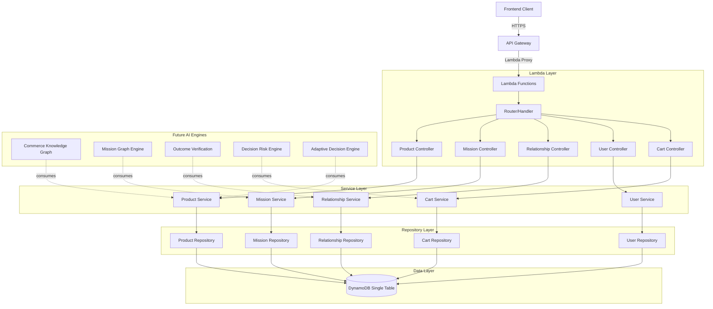
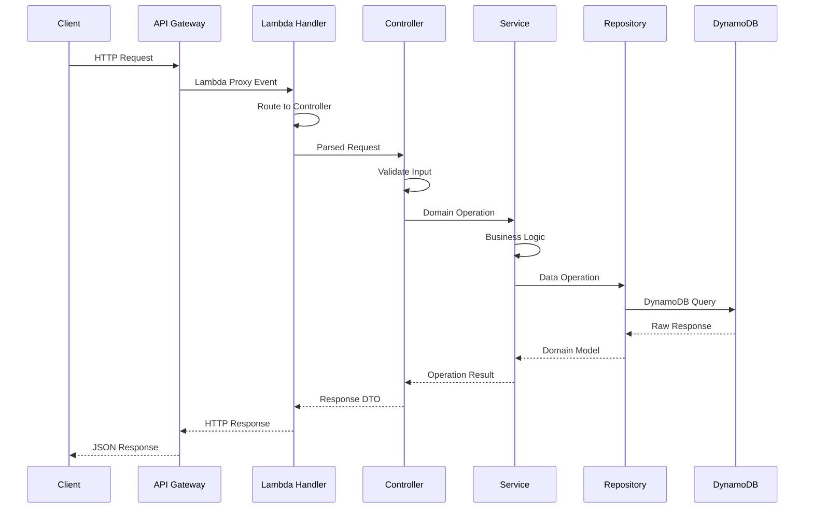
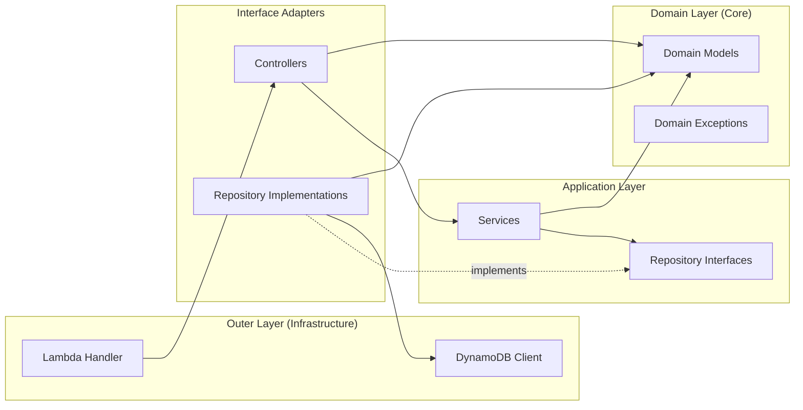

# Design Document: LifeGraph Backend Foundation

## Overview

Amazon LifeGraph is a mission-centric commerce intelligence platform that transforms traditional product-catalog commerce into a graph-based decision system. The backend foundation provides the core CRUD infrastructure for five domains (Products, Missions, Relationships, Users, Carts) built on a single-table DynamoDB design, exposed via API Gateway and powered by AWS Lambda.

The architecture follows Clean Architecture principles with strict layer separation: API Gateway → Lambda Handler → Controller → Service → Repository → DynamoDB. This layered approach ensures future AI engines (Commerce Knowledge Graph, Mission Graph Engine, Outcome Verification Engine, etc.) can consume services and repositories without modifying existing CRUD implementations. Every domain enforces the Controller-Service-Repository-Model pattern, and business logic never leaks into route handlers or data access layers.

The system is designed for production-grade extensibility. New engines attach at the service layer, new domains follow the established pattern, and the single-table DynamoDB design supports complex graph queries through carefully designed access patterns using partition keys, sort keys, and Global Secondary Indexes.

## Architecture

### System Architecture



### Request Flow



### Dependency Flow (Clean Architecture)



### Folder Structure

```
lifegraph-backend/
├── template.yaml                    # AWS SAM template
├── samconfig.toml                   # SAM deployment config
├── requirements.txt                 # Python dependencies
├── tests/
│   ├── unit/
│   ├── integration/
│   └── conftest.py
├── src/
│   ├── __init__.py
│   ├── app.py                       # Lambda handler entry point
│   ├── router.py                    # Request routing
│   ├── shared/
│   │   ├── __init__.py
│   │   ├── dynamodb_client.py       # DynamoDB client singleton
│   │   ├── exceptions.py           # Domain exceptions
│   │   ├── response.py             # Standardized HTTP responses
│   │   ├── validators.py           # Common validation utilities
│   │   ├── pagination.py           # Pagination helpers
│   │   └── base_repository.py      # Abstract base repository
│   ├── products/
│   │   ├── __init__.py
│   │   ├── controller.py
│   │   ├── service.py
│   │   ├── repository.py
│   │   └── model.py
│   ├── missions/
│   │   ├── __init__.py
│   │   ├── controller.py
│   │   ├── service.py
│   │   ├── repository.py
│   │   └── model.py
│   ├── relationships/
│   │   ├── __init__.py
│   │   ├── controller.py
│   │   ├── service.py
│   │   ├── repository.py
│   │   └── model.py
│   ├── users/
│   │   ├── __init__.py
│   │   ├── controller.py
│   │   ├── service.py
│   │   ├── repository.py
│   │   └── model.py
│   └── carts/
│       ├── __init__.py
│       ├── controller.py
│       ├── service.py
│       ├── repository.py
│       └── model.py
```

## Components and Interfaces

### Component 1: Lambda Handler & Router

**Purpose**: Entry point for all API requests. Routes requests to the appropriate controller based on path and HTTP method.

**Responsibilities**:
- Parse Lambda proxy integration events
- Route requests to correct controller
- Handle uncaught exceptions with standardized error responses
- Set CORS headers

### Component 2: Controllers

**Purpose**: Request validation and response formatting. Controllers are thin — they validate, delegate, and respond.

**Responsibilities**:
- Validate request body, path parameters, and query parameters
- Parse request into domain-specific DTOs
- Call appropriate service method
- Format service response into HTTP response

### Component 3: Services

**Purpose**: Business logic orchestration. Services coordinate operations across repositories and enforce domain rules.

**Responsibilities**:
- Enforce business rules and constraints
- Orchestrate multi-step operations
- Handle domain-level validation (e.g., uniqueness checks)
- Provide interface for future AI engine consumption

### Component 4: Repositories

**Purpose**: Data access abstraction. Only repositories interact with DynamoDB.

**Responsibilities**:
- Translate domain models to/from DynamoDB items
- Execute DynamoDB operations (put, get, update, delete, query)
- Handle pagination tokens
- Manage key construction for single-table design

### Component 5: Domain Models

**Purpose**: Core data structures representing business entities.

**Responsibilities**:
- Define entity structure with type annotations
- Provide serialization/deserialization
- Enforce invariants via dataclass constraints

## Data Models

### Product Model

```python
from dataclasses import dataclass, field
from typing import Optional
from datetime import datetime


@dataclass
class Product:
    product_id: str
    name: str
    category: str
    price: float
    description: Optional[str] = None
    attributes: dict = field(default_factory=dict)
    tags: list[str] = field(default_factory=list)
    created_at: str = field(default_factory=lambda: datetime.utcnow().isoformat())
    updated_at: str = field(default_factory=lambda: datetime.utcnow().isoformat())

    # DynamoDB Key Mappings
    # PK: PRODUCT#{product_id}
    # SK: PRODUCT#{product_id}
    # GSI1PK: CATEGORY#{category}
    # GSI1SK: PRODUCT#{product_id}
```

**Validation Rules**:
- `product_id`: Required, non-empty string, alphanumeric with hyphens
- `name`: Required, 1-256 characters
- `category`: Required, non-empty string
- `price`: Required, positive float, max 2 decimal places
- `tags`: Optional, max 20 tags, each tag max 50 characters

### Mission Model

```python
@dataclass
class Mission:
    mission_id: str
    user_id: str
    name: str
    mission_type: str  # e.g., BIRTHDAY, WEDDING, DINNER_PARTY
    status: str = "ACTIVE"  # ACTIVE, COMPLETED, CANCELLED
    description: Optional[str] = None
    target_date: Optional[str] = None
    budget: Optional[float] = None
    metadata: dict = field(default_factory=dict)
    created_at: str = field(default_factory=lambda: datetime.utcnow().isoformat())
    updated_at: str = field(default_factory=lambda: datetime.utcnow().isoformat())

    # DynamoDB Key Mappings
    # PK: MISSION#{mission_id}
    # SK: MISSION#{mission_id}
    # GSI1PK: USER#{user_id}
    # GSI1SK: MISSION#{mission_id}
```

**Validation Rules**:
- `mission_id`: Required, non-empty, alphanumeric with hyphens
- `user_id`: Required, non-empty
- `name`: Required, 1-256 characters
- `mission_type`: Required, must be a recognized type enum
- `status`: Must be one of ACTIVE, COMPLETED, CANCELLED
- `budget`: Optional, positive float if provided

### Relationship Model

```python
@dataclass
class Relationship:
    source_id: str
    target_id: str
    relationship_type: str  # REQUIRES, DEPENDS_ON, COMPLEMENTS, SUBSTITUTES
    strength: float = 1.0  # 0.0 to 1.0
    metadata: dict = field(default_factory=dict)
    created_at: str = field(default_factory=lambda: datetime.utcnow().isoformat())

    # DynamoDB Key Mappings (Graph Edge)
    # PK: {source_entity_type}#{source_id}
    # SK: {relationship_type}#{target_entity_type}#{target_id}
    # GSI1PK: {target_entity_type}#{target_id}
    # GSI1SK: {relationship_type}#{source_entity_type}#{source_id}
```

**Validation Rules**:
- `source_id`: Required, must reference existing entity
- `target_id`: Required, must reference existing entity
- `relationship_type`: Required, must be recognized enum
- `strength`: Float between 0.0 and 1.0 inclusive

### User Model

```python
@dataclass
class User:
    user_id: str
    email: str
    display_name: str
    preferences: dict = field(default_factory=dict)
    created_at: str = field(default_factory=lambda: datetime.utcnow().isoformat())
    updated_at: str = field(default_factory=lambda: datetime.utcnow().isoformat())

    # DynamoDB Key Mappings
    # PK: USER#{user_id}
    # SK: USER#{user_id}
    # GSI1PK: EMAIL#{email}
    # GSI1SK: USER#{user_id}
```

**Validation Rules**:
- `user_id`: Required, non-empty, alphanumeric with hyphens
- `email`: Required, valid email format
- `display_name`: Required, 1-128 characters

### Cart Model

```python
@dataclass
class CartItem:
    product_id: str
    quantity: int
    added_at: str = field(default_factory=lambda: datetime.utcnow().isoformat())


@dataclass
class Cart:
    cart_id: str
    user_id: str
    mission_id: Optional[str] = None  # Cart can be linked to a mission
    items: list[CartItem] = field(default_factory=list)
    status: str = "ACTIVE"  # ACTIVE, CHECKED_OUT, ABANDONED
    created_at: str = field(default_factory=lambda: datetime.utcnow().isoformat())
    updated_at: str = field(default_factory=lambda: datetime.utcnow().isoformat())

    # DynamoDB Key Mappings
    # PK: CART#{cart_id}
    # SK: CART#{cart_id}
    # GSI1PK: USER#{user_id}
    # GSI1SK: CART#{cart_id}
```

**Validation Rules**:
- `cart_id`: Required, non-empty
- `user_id`: Required, must reference existing user
- `items`: Each item must have valid product_id and quantity > 0
- `status`: Must be one of ACTIVE, CHECKED_OUT, ABANDONED

## Algorithmic Pseudocode

### Single-Table Key Construction Algorithm

```python
def construct_keys(entity_type: str, entity_id: str, gsi_context: dict) -> dict:
    """
    Construct DynamoDB keys for any entity in the single-table design.
    
    Args:
        entity_type: The entity type prefix (PRODUCT, MISSION, USER, CART)
        entity_id: The unique identifier for the entity
        gsi_context: Additional context for GSI keys (e.g., category, user_id, email)
    
    Returns:
        Dictionary containing PK, SK, GSI1PK, GSI1SK
    """
    # Step 1: Construct primary key pair
    pk = f"{entity_type}#{entity_id}"
    sk = f"{entity_type}#{entity_id}"
    
    # Step 2: Construct GSI keys based on entity type
    gsi1pk = None
    gsi1sk = None
    
    if entity_type == "PRODUCT":
        gsi1pk = f"CATEGORY#{gsi_context['category']}"
        gsi1sk = f"PRODUCT#{entity_id}"
    elif entity_type == "MISSION":
        gsi1pk = f"USER#{gsi_context['user_id']}"
        gsi1sk = f"MISSION#{entity_id}"
    elif entity_type == "USER":
        gsi1pk = f"EMAIL#{gsi_context['email']}"
        gsi1sk = f"USER#{entity_id}"
    elif entity_type == "CART":
        gsi1pk = f"USER#{gsi_context['user_id']}"
        gsi1sk = f"CART#{entity_id}"
    
    return {"PK": pk, "SK": sk, "GSI1PK": gsi1pk, "GSI1SK": gsi1sk}
```

**Preconditions:**
- `entity_type` is a recognized entity type string
- `entity_id` is non-empty and valid
- `gsi_context` contains required keys for the given entity_type

**Postconditions:**
- Returns dict with non-null PK, SK
- GSI1PK and GSI1SK are set appropriately for the entity type
- All key values follow the `{PREFIX}#{ID}` pattern

### Graph Edge Key Construction Algorithm

```python
def construct_edge_keys(
    source_type: str,
    source_id: str,
    relationship_type: str,
    target_type: str,
    target_id: str
) -> dict:
    """
    Construct DynamoDB keys for graph edges (relationships).
    Enables bidirectional traversal via GSI.
    
    Args:
        source_type: Entity type of source node
        source_id: ID of source node
        relationship_type: Type of relationship (REQUIRES, DEPENDS_ON, etc.)
        target_type: Entity type of target node
        target_id: ID of target node
    
    Returns:
        Dictionary containing PK, SK, GSI1PK, GSI1SK for bidirectional traversal
    """
    # Forward traversal: "Given source, find all targets"
    pk = f"{source_type}#{source_id}"
    sk = f"{relationship_type}#{target_type}#{target_id}"
    
    # Reverse traversal via GSI: "Given target, find all sources"
    gsi1pk = f"{target_type}#{target_id}"
    gsi1sk = f"{relationship_type}#{source_type}#{source_id}"
    
    return {"PK": pk, "SK": sk, "GSI1PK": gsi1pk, "GSI1SK": gsi1sk}
```

**Preconditions:**
- All parameters are non-empty strings
- `relationship_type` is a recognized relationship enum
- Source and target entities exist in the table

**Postconditions:**
- PK enables forward graph traversal (source → targets)
- GSI1PK enables reverse graph traversal (target → sources)
- SK prefix enables filtering by relationship type

### Pagination Algorithm

```python
def paginate_query(
    table,
    key_condition: dict,
    page_size: int = 20,
    last_evaluated_key: Optional[dict] = None
) -> tuple[list[dict], Optional[str]]:
    """
    Execute paginated DynamoDB query with cursor-based pagination.
    
    Args:
        table: DynamoDB table resource
        key_condition: Key condition expression for Query
        page_size: Number of items per page (max 100)
        last_evaluated_key: Decoded pagination cursor from previous response
    
    Returns:
        Tuple of (items, next_cursor) where next_cursor is None if no more pages
    """
    # Step 1: Validate page size
    page_size = min(max(page_size, 1), 100)
    
    # Step 2: Build query params
    query_params = {
        **key_condition,
        "Limit": page_size,
    }
    
    if last_evaluated_key:
        query_params["ExclusiveStartKey"] = last_evaluated_key
    
    # Step 3: Execute query
    response = table.query(**query_params)
    
    # Step 4: Extract results and cursor
    items = response.get("Items", [])
    next_key = response.get("LastEvaluatedKey")
    
    # Step 5: Encode cursor for client
    next_cursor = encode_cursor(next_key) if next_key else None
    
    return items, next_cursor
```

**Preconditions:**
- `table` is a valid DynamoDB Table resource
- `key_condition` contains valid KeyConditionExpression
- `page_size` is a positive integer
- `last_evaluated_key` is either None or a valid DynamoDB key dict

**Postconditions:**
- Returns at most `page_size` items
- `next_cursor` is None if and only if there are no more items
- Items are ordered by sort key

**Loop Invariants:** N/A (single query operation, no iteration)

## Key Functions with Formal Specifications

### Base Repository Interface

```python
from abc import ABC, abstractmethod
from typing import TypeVar, Generic, Optional

T = TypeVar("T")


class BaseRepository(ABC, Generic[T]):
    """Abstract base repository defining the contract for all domain repositories."""

    @abstractmethod
    def create(self, entity: T) -> T:
        """Persist a new entity."""
        ...

    @abstractmethod
    def get(self, entity_id: str) -> Optional[T]:
        """Retrieve entity by ID. Returns None if not found."""
        ...

    @abstractmethod
    def update(self, entity_id: str, updates: dict) -> T:
        """Apply partial updates to an existing entity."""
        ...

    @abstractmethod
    def delete(self, entity_id: str) -> bool:
        """Delete entity by ID. Returns True if deleted, False if not found."""
        ...

    @abstractmethod
    def list(self, page_size: int = 20, cursor: Optional[str] = None) -> tuple[list[T], Optional[str]]:
        """List entities with pagination."""
        ...
```

**Preconditions (all methods):**
- Repository is initialized with valid DynamoDB table reference
- `entity_id` parameters are non-empty strings

**Postconditions:**
- `create`: Entity is persisted; returned entity has all fields populated including timestamps
- `get`: Returns entity if exists, None otherwise; no side effects
- `update`: Entity exists and is updated; returned entity reflects changes; `updated_at` is refreshed
- `delete`: Entity is removed if exists; returns boolean indicating whether deletion occurred
- `list`: Returns tuple of (items, next_cursor); items length ≤ page_size

### Product Repository Implementation

```python
import boto3
from boto3.dynamodb.conditions import Key
from typing import Optional
from datetime import datetime

from src.shared.base_repository import BaseRepository
from src.shared.dynamodb_client import get_table
from src.shared.pagination import encode_cursor, decode_cursor
from src.products.model import Product


class ProductRepository(BaseRepository[Product]):
    """Repository for Product entity DynamoDB operations."""

    def __init__(self):
        self._table = get_table()
        self._entity_type = "PRODUCT"

    def create(self, entity: Product) -> Product:
        """
        Persist a new product to DynamoDB.
        
        Preconditions:
            - entity.product_id is unique (not already in table)
            - entity has all required fields populated
        Postconditions:
            - Item exists in DynamoDB with correct PK/SK/GSI keys
            - Returns the persisted Product with timestamps
        """
        item = {
            "PK": f"PRODUCT#{entity.product_id}",
            "SK": f"PRODUCT#{entity.product_id}",
            "GSI1PK": f"CATEGORY#{entity.category}",
            "GSI1SK": f"PRODUCT#{entity.product_id}",
            "entity_type": "PRODUCT",
            "product_id": entity.product_id,
            "name": entity.name,
            "category": entity.category,
            "price": str(entity.price),  # DynamoDB decimal handling
            "description": entity.description,
            "attributes": entity.attributes,
            "tags": entity.tags,
            "created_at": entity.created_at,
            "updated_at": entity.updated_at,
        }

        self._table.put_item(
            Item=item,
            ConditionExpression="attribute_not_exists(PK)"
        )

        return entity

    def get(self, entity_id: str) -> Optional[Product]:
        """
        Retrieve product by ID.
        
        Preconditions:
            - entity_id is non-empty string
        Postconditions:
            - Returns Product if PK/SK exist, None otherwise
        """
        response = self._table.get_item(
            Key={
                "PK": f"PRODUCT#{entity_id}",
                "SK": f"PRODUCT#{entity_id}",
            }
        )

        item = response.get("Item")
        if not item:
            return None

        return self._to_model(item)

    def update(self, entity_id: str, updates: dict) -> Product:
        """
        Apply partial updates to product.
        
        Preconditions:
            - entity_id references an existing product
            - updates dict contains only valid, mutable product fields
        Postconditions:
            - Only specified fields are modified
            - updated_at is refreshed
            - Returns updated Product
        """
        update_expr_parts = []
        expr_attr_values = {}
        expr_attr_names = {}

        updates["updated_at"] = datetime.utcnow().isoformat()

        for i, (key, value) in enumerate(updates.items()):
            placeholder_name = f"#field{i}"
            placeholder_value = f":val{i}"
            update_expr_parts.append(f"{placeholder_name} = {placeholder_value}")
            expr_attr_names[placeholder_name] = key
            expr_attr_values[placeholder_value] = value

        response = self._table.update_item(
            Key={
                "PK": f"PRODUCT#{entity_id}",
                "SK": f"PRODUCT#{entity_id}",
            },
            UpdateExpression="SET " + ", ".join(update_expr_parts),
            ExpressionAttributeNames=expr_attr_names,
            ExpressionAttributeValues=expr_attr_values,
            ConditionExpression="attribute_exists(PK)",
            ReturnValues="ALL_NEW",
        )

        return self._to_model(response["Attributes"])

    def delete(self, entity_id: str) -> bool:
        """
        Delete product by ID.
        
        Preconditions:
            - entity_id is non-empty string
        Postconditions:
            - Item no longer exists in table
            - Returns True if item was deleted, False if not found
        """
        try:
            self._table.delete_item(
                Key={
                    "PK": f"PRODUCT#{entity_id}",
                    "SK": f"PRODUCT#{entity_id}",
                },
                ConditionExpression="attribute_exists(PK)",
            )
            return True
        except self._table.meta.client.exceptions.ConditionalCheckFailedException:
            return False

    def list(
        self, page_size: int = 20, cursor: Optional[str] = None
    ) -> tuple[list[Product], Optional[str]]:
        """
        List all products with pagination.
        
        Preconditions:
            - page_size between 1 and 100
            - cursor is None or valid encoded pagination token
        Postconditions:
            - Returns at most page_size products
            - next_cursor is None iff no more items exist
        """
        query_params = {
            "IndexName": "GSI1",
            "KeyConditionExpression": Key("GSI1PK").begins_with("CATEGORY#"),
            "Limit": min(max(page_size, 1), 100),
        }

        if cursor:
            query_params["ExclusiveStartKey"] = decode_cursor(cursor)

        response = self._table.query(**query_params)
        items = [self._to_model(item) for item in response.get("Items", [])]
        next_key = response.get("LastEvaluatedKey")
        next_cursor = encode_cursor(next_key) if next_key else None

        return items, next_cursor

    def list_by_category(
        self, category: str, page_size: int = 20, cursor: Optional[str] = None
    ) -> tuple[list[Product], Optional[str]]:
        """
        List products filtered by category using GSI1.
        
        Preconditions:
            - category is non-empty string
        Postconditions:
            - All returned products have matching category
        """
        query_params = {
            "IndexName": "GSI1",
            "KeyConditionExpression": Key("GSI1PK").eq(f"CATEGORY#{category}"),
            "Limit": min(max(page_size, 1), 100),
        }

        if cursor:
            query_params["ExclusiveStartKey"] = decode_cursor(cursor)

        response = self._table.query(**query_params)
        items = [self._to_model(item) for item in response.get("Items", [])]
        next_key = response.get("LastEvaluatedKey")
        next_cursor = encode_cursor(next_key) if next_key else None

        return items, next_cursor

    def _to_model(self, item: dict) -> Product:
        """Convert DynamoDB item to Product domain model."""
        return Product(
            product_id=item["product_id"],
            name=item["name"],
            category=item["category"],
            price=float(item["price"]),
            description=item.get("description"),
            attributes=item.get("attributes", {}),
            tags=item.get("tags", []),
            created_at=item["created_at"],
            updated_at=item["updated_at"],
        )
```

### Mission Repository Implementation

```python
class MissionRepository(BaseRepository[Mission]):
    """Repository for Mission entity DynamoDB operations."""

    def __init__(self):
        self._table = get_table()
        self._entity_type = "MISSION"

    def create(self, entity: Mission) -> Mission:
        item = {
            "PK": f"MISSION#{entity.mission_id}",
            "SK": f"MISSION#{entity.mission_id}",
            "GSI1PK": f"USER#{entity.user_id}",
            "GSI1SK": f"MISSION#{entity.mission_id}",
            "entity_type": "MISSION",
            "mission_id": entity.mission_id,
            "user_id": entity.user_id,
            "name": entity.name,
            "mission_type": entity.mission_type,
            "status": entity.status,
            "description": entity.description,
            "target_date": entity.target_date,
            "budget": str(entity.budget) if entity.budget else None,
            "metadata": entity.metadata,
            "created_at": entity.created_at,
            "updated_at": entity.updated_at,
        }
        self._table.put_item(Item=item, ConditionExpression="attribute_not_exists(PK)")
        return entity

    def get(self, entity_id: str) -> Optional[Mission]:
        response = self._table.get_item(
            Key={"PK": f"MISSION#{entity_id}", "SK": f"MISSION#{entity_id}"}
        )
        item = response.get("Item")
        return self._to_model(item) if item else None

    def update(self, entity_id: str, updates: dict) -> Mission:
        updates["updated_at"] = datetime.utcnow().isoformat()
        # Same update pattern as ProductRepository
        ...

    def delete(self, entity_id: str) -> bool:
        try:
            self._table.delete_item(
                Key={"PK": f"MISSION#{entity_id}", "SK": f"MISSION#{entity_id}"},
                ConditionExpression="attribute_exists(PK)",
            )
            return True
        except self._table.meta.client.exceptions.ConditionalCheckFailedException:
            return False

    def list(self, page_size: int = 20, cursor: Optional[str] = None) -> tuple[list[Mission], Optional[str]]:
        ...

    def list_by_user(self, user_id: str, page_size: int = 20, cursor: Optional[str] = None) -> tuple[list[Mission], Optional[str]]:
        """List missions for a specific user via GSI1."""
        query_params = {
            "IndexName": "GSI1",
            "KeyConditionExpression": Key("GSI1PK").eq(f"USER#{user_id}"),
            "Limit": min(max(page_size, 1), 100),
        }
        if cursor:
            query_params["ExclusiveStartKey"] = decode_cursor(cursor)
        response = self._table.query(**query_params)
        items = [self._to_model(item) for item in response.get("Items", [])]
        next_key = response.get("LastEvaluatedKey")
        return items, encode_cursor(next_key) if next_key else None

    def _to_model(self, item: dict) -> Mission:
        return Mission(
            mission_id=item["mission_id"],
            user_id=item["user_id"],
            name=item["name"],
            mission_type=item["mission_type"],
            status=item["status"],
            description=item.get("description"),
            target_date=item.get("target_date"),
            budget=float(item["budget"]) if item.get("budget") else None,
            metadata=item.get("metadata", {}),
            created_at=item["created_at"],
            updated_at=item["updated_at"],
        )
```

### Relationship Repository Implementation

```python
class RelationshipRepository(BaseRepository[Relationship]):
    """Repository for graph edge (Relationship) DynamoDB operations."""

    def __init__(self):
        self._table = get_table()

    def create(self, entity: Relationship) -> Relationship:
        """
        Create a graph edge between two entities.
        
        Preconditions:
            - source and target entities exist
            - No duplicate edge with same source/target/type combination
        Postconditions:
            - Edge is queryable in both directions (PK for forward, GSI1 for reverse)
        """
        item = {
            "PK": f"{self._resolve_type(entity.source_id)}#{entity.source_id}",
            "SK": f"{entity.relationship_type}#{self._resolve_type(entity.target_id)}#{entity.target_id}",
            "GSI1PK": f"{self._resolve_type(entity.target_id)}#{entity.target_id}",
            "GSI1SK": f"{entity.relationship_type}#{self._resolve_type(entity.source_id)}#{entity.source_id}",
            "entity_type": "RELATIONSHIP",
            "source_id": entity.source_id,
            "target_id": entity.target_id,
            "relationship_type": entity.relationship_type,
            "strength": str(entity.strength),
            "metadata": entity.metadata,
            "created_at": entity.created_at,
        }
        self._table.put_item(Item=item, ConditionExpression="attribute_not_exists(PK) OR attribute_not_exists(SK)")
        return entity

    def get_outgoing(self, source_id: str, relationship_type: Optional[str] = None) -> list[Relationship]:
        """
        Get all outgoing edges from a source node.
        Optionally filter by relationship type using SK begins_with.
        
        Preconditions:
            - source_id is valid entity ID
        Postconditions:
            - Returns all relationships where source_id is the source
            - If relationship_type provided, only matching types returned
        """
        source_type = self._resolve_type(source_id)
        key_condition = Key("PK").eq(f"{source_type}#{source_id}")
        
        if relationship_type:
            key_condition = key_condition & Key("SK").begins_with(f"{relationship_type}#")

        response = self._table.query(KeyConditionExpression=key_condition)
        return [self._to_model(item) for item in response.get("Items", []) if item.get("entity_type") == "RELATIONSHIP"]

    def get_incoming(self, target_id: str, relationship_type: Optional[str] = None) -> list[Relationship]:
        """
        Get all incoming edges to a target node via GSI1.
        
        Preconditions:
            - target_id is valid entity ID
        Postconditions:
            - Returns all relationships where target_id is the target
        """
        target_type = self._resolve_type(target_id)
        key_condition = Key("GSI1PK").eq(f"{target_type}#{target_id}")
        
        if relationship_type:
            key_condition = key_condition & Key("GSI1SK").begins_with(f"{relationship_type}#")

        response = self._table.query(
            IndexName="GSI1",
            KeyConditionExpression=key_condition
        )
        return [self._to_model(item) for item in response.get("Items", []) if item.get("entity_type") == "RELATIONSHIP"]

    def delete(self, entity_id: str) -> bool:
        """Delete requires composite key - use delete_edge instead."""
        raise NotImplementedError("Use delete_edge(source_id, relationship_type, target_id)")

    def delete_edge(self, source_id: str, relationship_type: str, target_id: str) -> bool:
        source_type = self._resolve_type(source_id)
        target_type = self._resolve_type(target_id)
        try:
            self._table.delete_item(
                Key={
                    "PK": f"{source_type}#{source_id}",
                    "SK": f"{relationship_type}#{target_type}#{target_id}",
                },
                ConditionExpression="attribute_exists(PK)",
            )
            return True
        except self._table.meta.client.exceptions.ConditionalCheckFailedException:
            return False

    def _resolve_type(self, entity_id: str) -> str:
        """Resolve entity type prefix from ID format or lookup."""
        # Entity IDs are prefixed: e.g., PRODUCT#123 stored as source_id
        # Implementation will parse or lookup
        ...

    def _to_model(self, item: dict) -> Relationship:
        return Relationship(
            source_id=item["source_id"],
            target_id=item["target_id"],
            relationship_type=item["relationship_type"],
            strength=float(item.get("strength", "1.0")),
            metadata=item.get("metadata", {}),
            created_at=item["created_at"],
        )
```

### User Repository Implementation

```python
class UserRepository(BaseRepository[User]):
    """Repository for User entity DynamoDB operations."""

    def __init__(self):
        self._table = get_table()

    def create(self, entity: User) -> User:
        item = {
            "PK": f"USER#{entity.user_id}",
            "SK": f"USER#{entity.user_id}",
            "GSI1PK": f"EMAIL#{entity.email}",
            "GSI1SK": f"USER#{entity.user_id}",
            "entity_type": "USER",
            "user_id": entity.user_id,
            "email": entity.email,
            "display_name": entity.display_name,
            "preferences": entity.preferences,
            "created_at": entity.created_at,
            "updated_at": entity.updated_at,
        }
        self._table.put_item(Item=item, ConditionExpression="attribute_not_exists(PK)")
        return entity

    def get(self, entity_id: str) -> Optional[User]:
        response = self._table.get_item(
            Key={"PK": f"USER#{entity_id}", "SK": f"USER#{entity_id}"}
        )
        item = response.get("Item")
        return self._to_model(item) if item else None

    def get_by_email(self, email: str) -> Optional[User]:
        """Lookup user by email via GSI1."""
        response = self._table.query(
            IndexName="GSI1",
            KeyConditionExpression=Key("GSI1PK").eq(f"EMAIL#{email}"),
            Limit=1,
        )
        items = response.get("Items", [])
        return self._to_model(items[0]) if items else None

    def update(self, entity_id: str, updates: dict) -> User:
        ...

    def delete(self, entity_id: str) -> bool:
        try:
            self._table.delete_item(
                Key={"PK": f"USER#{entity_id}", "SK": f"USER#{entity_id}"},
                ConditionExpression="attribute_exists(PK)",
            )
            return True
        except self._table.meta.client.exceptions.ConditionalCheckFailedException:
            return False

    def list(self, page_size: int = 20, cursor: Optional[str] = None) -> tuple[list[User], Optional[str]]:
        ...

    def _to_model(self, item: dict) -> User:
        return User(
            user_id=item["user_id"],
            email=item["email"],
            display_name=item["display_name"],
            preferences=item.get("preferences", {}),
            created_at=item["created_at"],
            updated_at=item["updated_at"],
        )
```

### Cart Repository Implementation

```python
class CartRepository(BaseRepository[Cart]):
    """Repository for Cart entity DynamoDB operations."""

    def __init__(self):
        self._table = get_table()

    def create(self, entity: Cart) -> Cart:
        item = {
            "PK": f"CART#{entity.cart_id}",
            "SK": f"CART#{entity.cart_id}",
            "GSI1PK": f"USER#{entity.user_id}",
            "GSI1SK": f"CART#{entity.cart_id}",
            "entity_type": "CART",
            "cart_id": entity.cart_id,
            "user_id": entity.user_id,
            "mission_id": entity.mission_id,
            "items": [{"product_id": i.product_id, "quantity": i.quantity, "added_at": i.added_at} for i in entity.items],
            "status": entity.status,
            "created_at": entity.created_at,
            "updated_at": entity.updated_at,
        }
        self._table.put_item(Item=item, ConditionExpression="attribute_not_exists(PK)")
        return entity

    def get(self, entity_id: str) -> Optional[Cart]:
        response = self._table.get_item(
            Key={"PK": f"CART#{entity_id}", "SK": f"CART#{entity_id}"}
        )
        item = response.get("Item")
        return self._to_model(item) if item else None

    def add_item(self, cart_id: str, product_id: str, quantity: int) -> Cart:
        """
        Add item to cart or increment quantity if already exists.
        
        Preconditions:
            - cart_id references existing cart
            - product_id references existing product
            - quantity > 0
        Postconditions:
            - Cart contains item with specified product_id
            - If item existed, quantity is incremented
            - updated_at is refreshed
        """
        ...

    def remove_item(self, cart_id: str, product_id: str) -> Cart:
        """
        Remove item from cart.
        
        Preconditions:
            - cart_id references existing cart
            - product_id exists in cart items
        Postconditions:
            - Cart no longer contains item with product_id
            - updated_at is refreshed
        """
        ...

    def list_by_user(self, user_id: str, page_size: int = 20, cursor: Optional[str] = None) -> tuple[list[Cart], Optional[str]]:
        """List carts for a user via GSI1."""
        query_params = {
            "IndexName": "GSI1",
            "KeyConditionExpression": Key("GSI1PK").eq(f"USER#{user_id}"),
            "Limit": min(max(page_size, 1), 100),
        }
        if cursor:
            query_params["ExclusiveStartKey"] = decode_cursor(cursor)
        response = self._table.query(**query_params)
        items = [self._to_model(item) for item in response.get("Items", [])]
        next_key = response.get("LastEvaluatedKey")
        return items, encode_cursor(next_key) if next_key else None

    def update(self, entity_id: str, updates: dict) -> Cart:
        ...

    def delete(self, entity_id: str) -> bool:
        try:
            self._table.delete_item(
                Key={"PK": f"CART#{entity_id}", "SK": f"CART#{entity_id}"},
                ConditionExpression="attribute_exists(PK)",
            )
            return True
        except self._table.meta.client.exceptions.ConditionalCheckFailedException:
            return False

    def list(self, page_size: int = 20, cursor: Optional[str] = None) -> tuple[list[Cart], Optional[str]]:
        ...

    def _to_model(self, item: dict) -> Cart:
        cart_items = [
            CartItem(product_id=i["product_id"], quantity=i["quantity"], added_at=i["added_at"])
            for i in item.get("items", [])
        ]
        return Cart(
            cart_id=item["cart_id"],
            user_id=item["user_id"],
            mission_id=item.get("mission_id"),
            items=cart_items,
            status=item["status"],
            created_at=item["created_at"],
            updated_at=item["updated_at"],
        )
```

### Service Layer Interfaces

```python
class ProductService:
    """Business logic for Product operations."""

    def __init__(self, repository: ProductRepository):
        self._repository = repository

    def create_product(self, data: dict) -> Product:
        """
        Create a new product.
        
        Preconditions:
            - data contains all required fields (name, category, price)
            - product_id is unique
        Postconditions:
            - Product persisted with generated ID and timestamps
            - Returns created Product
        Raises:
            - EntityAlreadyExistsError if product_id collision
            - ValidationError if data is invalid
        """
        product_id = generate_id()
        product = Product(
            product_id=product_id,
            name=data["name"],
            category=data["category"],
            price=data["price"],
            description=data.get("description"),
            attributes=data.get("attributes", {}),
            tags=data.get("tags", []),
        )
        return self._repository.create(product)

    def get_product(self, product_id: str) -> Product:
        """
        Retrieve product by ID.
        Raises EntityNotFoundError if not found.
        """
        product = self._repository.get(product_id)
        if not product:
            raise EntityNotFoundError("Product", product_id)
        return product

    def update_product(self, product_id: str, updates: dict) -> Product:
        """
        Update product fields.
        Only allows updating mutable fields (name, category, price, description, attributes, tags).
        Raises EntityNotFoundError if not found.
        """
        allowed_fields = {"name", "category", "price", "description", "attributes", "tags"}
        filtered = {k: v for k, v in updates.items() if k in allowed_fields}
        if not filtered:
            raise ValidationError("No valid fields to update")
        return self._repository.update(product_id, filtered)

    def delete_product(self, product_id: str) -> bool:
        """Delete product. Returns True if deleted."""
        deleted = self._repository.delete(product_id)
        if not deleted:
            raise EntityNotFoundError("Product", product_id)
        return True

    def list_products(self, page_size: int = 20, cursor: Optional[str] = None, category: Optional[str] = None) -> tuple[list[Product], Optional[str]]:
        """List products with optional category filter."""
        if category:
            return self._repository.list_by_category(category, page_size, cursor)
        return self._repository.list(page_size, cursor)


class MissionService:
    """Business logic for Mission operations."""

    def __init__(self, repository: MissionRepository):
        self._repository = repository

    def create_mission(self, user_id: str, data: dict) -> Mission:
        """Create mission for a user."""
        ...

    def get_mission(self, mission_id: str) -> Mission:
        """Get mission by ID."""
        ...

    def update_mission(self, mission_id: str, updates: dict) -> Mission:
        """Update mission fields."""
        ...

    def delete_mission(self, mission_id: str) -> bool:
        """Delete mission."""
        ...

    def list_missions(self, user_id: Optional[str] = None, page_size: int = 20, cursor: Optional[str] = None) -> tuple[list[Mission], Optional[str]]:
        """List missions, optionally filtered by user."""
        if user_id:
            return self._repository.list_by_user(user_id, page_size, cursor)
        return self._repository.list(page_size, cursor)

    def complete_mission(self, mission_id: str) -> Mission:
        """Mark mission as completed."""
        return self._repository.update(mission_id, {"status": "COMPLETED"})


class RelationshipService:
    """Business logic for graph edge operations."""

    def __init__(self, repository: RelationshipRepository):
        self._repository = repository

    def create_relationship(self, data: dict) -> Relationship:
        """Create edge between two entities."""
        ...

    def get_related(self, entity_id: str, direction: str = "outgoing", relationship_type: Optional[str] = None) -> list[Relationship]:
        """
        Get relationships for an entity.
        direction: 'outgoing' or 'incoming'
        """
        if direction == "outgoing":
            return self._repository.get_outgoing(entity_id, relationship_type)
        return self._repository.get_incoming(entity_id, relationship_type)

    def delete_relationship(self, source_id: str, relationship_type: str, target_id: str) -> bool:
        """Delete specific edge."""
        return self._repository.delete_edge(source_id, relationship_type, target_id)


class UserService:
    """Business logic for User operations."""

    def __init__(self, repository: UserRepository):
        self._repository = repository

    def create_user(self, data: dict) -> User:
        """Create user. Ensures email uniqueness."""
        existing = self._repository.get_by_email(data["email"])
        if existing:
            raise EntityAlreadyExistsError("User", f"email={data['email']}")
        ...

    def get_user(self, user_id: str) -> User:
        ...

    def update_user(self, user_id: str, updates: dict) -> User:
        ...

    def delete_user(self, user_id: str) -> bool:
        ...

    def list_users(self, page_size: int = 20, cursor: Optional[str] = None) -> tuple[list[User], Optional[str]]:
        ...


class CartService:
    """Business logic for Cart operations."""

    def __init__(self, repository: CartRepository, product_service: ProductService):
        self._repository = repository
        self._product_service = product_service

    def create_cart(self, user_id: str, mission_id: Optional[str] = None) -> Cart:
        """Create empty cart for user, optionally linked to mission."""
        ...

    def get_cart(self, cart_id: str) -> Cart:
        ...

    def add_to_cart(self, cart_id: str, product_id: str, quantity: int) -> Cart:
        """
        Add product to cart.
        Validates product exists before adding.
        """
        self._product_service.get_product(product_id)  # Validates existence
        return self._repository.add_item(cart_id, product_id, quantity)

    def remove_from_cart(self, cart_id: str, product_id: str) -> Cart:
        ...

    def checkout(self, cart_id: str) -> Cart:
        """Mark cart as checked out."""
        return self._repository.update(cart_id, {"status": "CHECKED_OUT"})

    def delete_cart(self, cart_id: str) -> bool:
        ...

    def list_user_carts(self, user_id: str, page_size: int = 20, cursor: Optional[str] = None) -> tuple[list[Cart], Optional[str]]:
        return self._repository.list_by_user(user_id, page_size, cursor)
```

### Controller Layer

```python
from src.shared.response import success_response, created_response, no_content_response, error_response
from src.shared.validators import validate_required, validate_email, validate_positive_number


class ProductController:
    """HTTP request handling for Product endpoints."""

    def __init__(self, service: ProductService):
        self._service = service

    def create(self, event: dict) -> dict:
        """
        POST /products
        
        Request Body: { name, category, price, description?, attributes?, tags? }
        Response: 201 Created with product object
        """
        body = parse_body(event)
        validate_required(body, ["name", "category", "price"])
        validate_positive_number(body["price"], "price")
        
        product = self._service.create_product(body)
        return created_response(product.__dict__)

    def get(self, event: dict) -> dict:
        """
        GET /products/{product_id}
        
        Response: 200 OK with product object
        """
        product_id = event["pathParameters"]["product_id"]
        product = self._service.get_product(product_id)
        return success_response(product.__dict__)

    def update(self, event: dict) -> dict:
        """
        PUT /products/{product_id}
        
        Request Body: { name?, category?, price?, description?, attributes?, tags? }
        Response: 200 OK with updated product object
        """
        product_id = event["pathParameters"]["product_id"]
        body = parse_body(event)
        product = self._service.update_product(product_id, body)
        return success_response(product.__dict__)

    def delete(self, event: dict) -> dict:
        """
        DELETE /products/{product_id}
        
        Response: 204 No Content
        """
        product_id = event["pathParameters"]["product_id"]
        self._service.delete_product(product_id)
        return no_content_response()

    def list(self, event: dict) -> dict:
        """
        GET /products?page_size=20&cursor=abc&category=electronics
        
        Response: 200 OK with { items: [...], next_cursor: "..." }
        """
        params = event.get("queryStringParameters") or {}
        page_size = int(params.get("page_size", "20"))
        cursor = params.get("cursor")
        category = params.get("category")
        
        products, next_cursor = self._service.list_products(page_size, cursor, category)
        return success_response({
            "items": [p.__dict__ for p in products],
            "next_cursor": next_cursor,
        })
```

## Example Usage

### Lambda Handler Entry Point

```python
import json
from src.products.controller import ProductController
from src.products.service import ProductService
from src.products.repository import ProductRepository
from src.missions.controller import MissionController
from src.missions.service import MissionService
from src.missions.repository import MissionRepository
from src.shared.exceptions import EntityNotFoundError, ValidationError, EntityAlreadyExistsError
from src.shared.response import error_response


# Dependency injection
product_repo = ProductRepository()
product_service = ProductService(product_repo)
product_controller = ProductController(product_service)

mission_repo = MissionRepository()
mission_service = MissionService(mission_repo)
mission_controller = MissionController(mission_service)

# Route table
ROUTES = {
    ("POST", "/products"): product_controller.create,
    ("GET", "/products"): product_controller.list,
    ("GET", "/products/{product_id}"): product_controller.get,
    ("PUT", "/products/{product_id}"): product_controller.update,
    ("DELETE", "/products/{product_id}"): product_controller.delete,
    ("POST", "/missions"): mission_controller.create,
    ("GET", "/missions"): mission_controller.list,
    ("GET", "/missions/{mission_id}"): mission_controller.get,
    ("PUT", "/missions/{mission_id}"): mission_controller.update,
    ("DELETE", "/missions/{mission_id}"): mission_controller.delete,
    # ... relationships, users, carts routes
}


def handler(event, context):
    """AWS Lambda handler - routes requests to controllers."""
    method = event["httpMethod"]
    path = event["resource"]

    route_key = (method, path)
    controller_method = ROUTES.get(route_key)

    if not controller_method:
        return error_response(404, "Route not found")

    try:
        return controller_method(event)
    except ValidationError as e:
        return error_response(400, str(e))
    except EntityNotFoundError as e:
        return error_response(404, str(e))
    except EntityAlreadyExistsError as e:
        return error_response(409, str(e))
    except Exception as e:
        return error_response(500, "Internal server error")
```

### Shared Response Utilities

```python
import json


def success_response(data: dict, status_code: int = 200) -> dict:
    return {
        "statusCode": status_code,
        "headers": {
            "Content-Type": "application/json",
            "Access-Control-Allow-Origin": "*",
        },
        "body": json.dumps(data, default=str),
    }


def created_response(data: dict) -> dict:
    return success_response(data, 201)


def no_content_response() -> dict:
    return {"statusCode": 204, "headers": {"Access-Control-Allow-Origin": "*"}, "body": ""}


def error_response(status_code: int, message: str) -> dict:
    return {
        "statusCode": status_code,
        "headers": {
            "Content-Type": "application/json",
            "Access-Control-Allow-Origin": "*",
        },
        "body": json.dumps({"error": {"message": message, "code": status_code}}),
    }
```

### Shared Exceptions

```python
class LifeGraphError(Exception):
    """Base exception for LifeGraph application."""
    pass


class ValidationError(LifeGraphError):
    """Raised when input validation fails."""
    def __init__(self, message: str):
        super().__init__(f"Validation error: {message}")


class EntityNotFoundError(LifeGraphError):
    """Raised when an entity is not found."""
    def __init__(self, entity_type: str, entity_id: str):
        super().__init__(f"{entity_type} not found: {entity_id}")
        self.entity_type = entity_type
        self.entity_id = entity_id


class EntityAlreadyExistsError(LifeGraphError):
    """Raised when attempting to create a duplicate entity."""
    def __init__(self, entity_type: str, identifier: str):
        super().__init__(f"{entity_type} already exists: {identifier}")
```

## DynamoDB Single-Table Design

### Entity Access Patterns

| Access Pattern | Table/Index | Key Condition | Use Case |
|---|---|---|---|
| Get product by ID | Main Table | PK=PRODUCT#{id}, SK=PRODUCT#{id} | Product detail page |
| List products by category | GSI1 | GSI1PK=CATEGORY#{cat} | Browse by category |
| Get mission by ID | Main Table | PK=MISSION#{id}, SK=MISSION#{id} | Mission detail |
| List user's missions | GSI1 | GSI1PK=USER#{uid} & GSI1SK begins_with MISSION# | User dashboard |
| Get user by ID | Main Table | PK=USER#{id}, SK=USER#{id} | User profile |
| Get user by email | GSI1 | GSI1PK=EMAIL#{email} | Login/lookup |
| Get cart by ID | Main Table | PK=CART#{id}, SK=CART#{id} | Cart page |
| List user's carts | GSI1 | GSI1PK=USER#{uid} & GSI1SK begins_with CART# | User's carts |
| Get mission's products | Main Table | PK=MISSION#{id}, SK begins_with REQUIRES# | Mission requirements |
| Get product dependencies | Main Table | PK=PRODUCT#{id}, SK begins_with DEPENDS_ON# | Dependency graph |
| Reverse lookup: what missions need product | GSI1 | GSI1PK=PRODUCT#{id}, GSI1SK begins_with REQUIRES# | Impact analysis |

### Table Schema

```
Table: LifeGraphTable
├── Partition Key (PK): String
├── Sort Key (SK): String
├── GSI1:
│   ├── Partition Key (GSI1PK): String
│   └── Sort Key (GSI1SK): String
└── Attributes: (entity-specific)
```

### Entity Key Patterns

| Entity | PK | SK | GSI1PK | GSI1SK |
|--------|----|----|--------|--------|
| Product | PRODUCT#{product_id} | PRODUCT#{product_id} | CATEGORY#{category} | PRODUCT#{product_id} |
| Mission | MISSION#{mission_id} | MISSION#{mission_id} | USER#{user_id} | MISSION#{mission_id} |
| User | USER#{user_id} | USER#{user_id} | EMAIL#{email} | USER#{user_id} |
| Cart | CART#{cart_id} | CART#{cart_id} | USER#{user_id} | CART#{cart_id} |
| Graph Edge (REQUIRES) | MISSION#{mission_id} | REQUIRES#PRODUCT#{product_id} | PRODUCT#{product_id} | REQUIRES#MISSION#{mission_id} |
| Graph Edge (DEPENDS_ON) | PRODUCT#{product_id} | DEPENDS_ON#PRODUCT#{dep_id} | PRODUCT#{dep_id} | DEPENDS_ON#PRODUCT#{product_id} |
| Graph Edge (COMPLEMENTS) | PRODUCT#{product_id} | COMPLEMENTS#PRODUCT#{comp_id} | PRODUCT#{comp_id} | COMPLEMENTS#PRODUCT#{product_id} |
| Graph Edge (SUBSTITUTES) | PRODUCT#{product_id} | SUBSTITUTES#PRODUCT#{sub_id} | PRODUCT#{sub_id} | SUBSTITUTES#PRODUCT#{product_id} |

## Correctness Properties

### Property 1: Layer Isolation

```python
# For all requests R:
#   handler(R) calls only controller methods
#   controller methods call only service methods
#   service methods call only repository methods
#   repository methods call only DynamoDB client

# No layer may skip levels (e.g., controller must not call repository directly)
```

### Property 2: CRUD Idempotency

```python
# For all entities E and valid create payload P:
#   create(P) followed by get(E.id) returns E
#   update(E.id, changes) followed by get(E.id) reflects changes
#   delete(E.id) followed by get(E.id) returns None
#   delete(E.id) followed by delete(E.id) raises EntityNotFoundError
```

### Property 3: Pagination Completeness

```python
# For all list operations with N total items:
#   Iterating through all pages yields exactly N items
#   No item appears in multiple pages
#   Union of all pages equals the full result set
```

### Property 4: Graph Bidirectionality

```python
# For all relationships R(source, target, type):
#   get_outgoing(source, type) contains R
#   get_incoming(target, type) contains R
#   delete_edge(source, type, target) removes R from both directions
```

### Property 5: Single Table Key Uniqueness

```python
# For all entities E1, E2 where E1 != E2:
#   (E1.PK, E1.SK) != (E2.PK, E2.SK)
#   Entity type prefix guarantees partition isolation
```

## Error Handling

### Error Scenario 1: Entity Not Found

**Condition**: GET/PUT/DELETE request references non-existent entity ID
**Response**: HTTP 404 with `{"error": {"message": "Product not found: abc123", "code": 404}}`
**Recovery**: Client should verify entity exists or handle gracefully

### Error Scenario 2: Validation Failure

**Condition**: Request body missing required fields or contains invalid data
**Response**: HTTP 400 with `{"error": {"message": "Validation error: price must be positive", "code": 400}}`
**Recovery**: Client corrects payload and retries

### Error Scenario 3: Duplicate Entity

**Condition**: Create request with ID that already exists (ConditionalCheckFailedException)
**Response**: HTTP 409 with `{"error": {"message": "Product already exists: abc123", "code": 409}}`
**Recovery**: Client uses different ID or updates existing entity

### Error Scenario 4: DynamoDB Throttling

**Condition**: ProvisionedThroughputExceededException from DynamoDB
**Response**: HTTP 429 with retry-after header
**Recovery**: Client implements exponential backoff; consider DynamoDB auto-scaling

### Error Scenario 5: Internal Server Error

**Condition**: Unhandled exception in service/repository layer
**Response**: HTTP 500 with generic error message (no internal details leaked)
**Recovery**: Error logged to CloudWatch; alerts configured for 5xx spike

## Testing Strategy

### Unit Testing Approach

- Mock DynamoDB at the repository boundary using `moto` or `unittest.mock`
- Test each layer in isolation: controllers, services, repositories
- Achieve >90% code coverage across all domains
- Test validation logic exhaustively in controllers

### Property-Based Testing Approach

**Property Test Library**: `hypothesis`

Key properties to test:
- Round-trip serialization: `model → DynamoDB item → model` preserves all fields
- Key uniqueness: Generated keys for different entities never collide
- Pagination completeness: All items recoverable through paginated queries
- Validation consistency: Invalid inputs always rejected, valid inputs always accepted

### Integration Testing Approach

- Use DynamoDB Local for integration tests
- Test full request flow: event → handler → DynamoDB → response
- Verify access patterns work correctly with real DynamoDB queries
- Test concurrent access patterns (conditional writes, optimistic locking)

## AWS SAM Infrastructure

### template.yaml

```yaml
AWSTemplateFormatVersion: '2010-09-09'
Transform: AWS::Serverless-2016-10-31
Description: LifeGraph Backend Foundation

Globals:
  Function:
    Runtime: python3.12
    Timeout: 30
    MemorySize: 256
    Environment:
      Variables:
        TABLE_NAME: !Ref LifeGraphTable
        LOG_LEVEL: INFO

Resources:
  # DynamoDB Table
  LifeGraphTable:
    Type: AWS::DynamoDB::Table
    Properties:
      TableName: !Sub "${AWS::StackName}-lifegraph"
      BillingMode: PAY_PER_REQUEST
      AttributeDefinitions:
        - AttributeName: PK
          AttributeType: S
        - AttributeName: SK
          AttributeType: S
        - AttributeName: GSI1PK
          AttributeType: S
        - AttributeName: GSI1SK
          AttributeType: S
      KeySchema:
        - AttributeName: PK
          KeyType: HASH
        - AttributeName: SK
          KeyType: RANGE
      GlobalSecondaryIndexes:
        - IndexName: GSI1
          KeySchema:
            - AttributeName: GSI1PK
              KeyType: HASH
            - AttributeName: GSI1SK
              KeyType: RANGE
          Projection:
            ProjectionType: ALL
      PointInTimeRecoverySpecification:
        PointInTimeRecoveryEnabled: true

  # Lambda Function
  LifeGraphFunction:
    Type: AWS::Serverless::Function
    Properties:
      Handler: src.app.handler
      CodeUri: .
      Description: LifeGraph Backend API Handler
      Policies:
        - DynamoDBCrudPolicy:
            TableName: !Ref LifeGraphTable
      Events:
        # Products
        CreateProduct:
          Type: Api
          Properties:
            Path: /products
            Method: POST
            RestApiId: !Ref LifeGraphApi
        ListProducts:
          Type: Api
          Properties:
            Path: /products
            Method: GET
            RestApiId: !Ref LifeGraphApi
        GetProduct:
          Type: Api
          Properties:
            Path: /products/{product_id}
            Method: GET
            RestApiId: !Ref LifeGraphApi
        UpdateProduct:
          Type: Api
          Properties:
            Path: /products/{product_id}
            Method: PUT
            RestApiId: !Ref LifeGraphApi
        DeleteProduct:
          Type: Api
          Properties:
            Path: /products/{product_id}
            Method: DELETE
            RestApiId: !Ref LifeGraphApi
        # Missions
        CreateMission:
          Type: Api
          Properties:
            Path: /missions
            Method: POST
            RestApiId: !Ref LifeGraphApi
        ListMissions:
          Type: Api
          Properties:
            Path: /missions
            Method: GET
            RestApiId: !Ref LifeGraphApi
        GetMission:
          Type: Api
          Properties:
            Path: /missions/{mission_id}
            Method: GET
            RestApiId: !Ref LifeGraphApi
        UpdateMission:
          Type: Api
          Properties:
            Path: /missions/{mission_id}
            Method: PUT
            RestApiId: !Ref LifeGraphApi
        DeleteMission:
          Type: Api
          Properties:
            Path: /missions/{mission_id}
            Method: DELETE
            RestApiId: !Ref LifeGraphApi
        # Relationships
        CreateRelationship:
          Type: Api
          Properties:
            Path: /relationships
            Method: POST
            RestApiId: !Ref LifeGraphApi
        ListRelationships:
          Type: Api
          Properties:
            Path: /relationships
            Method: GET
            RestApiId: !Ref LifeGraphApi
        DeleteRelationship:
          Type: Api
          Properties:
            Path: /relationships
            Method: DELETE
            RestApiId: !Ref LifeGraphApi
        # Users
        CreateUser:
          Type: Api
          Properties:
            Path: /users
            Method: POST
            RestApiId: !Ref LifeGraphApi
        ListUsers:
          Type: Api
          Properties:
            Path: /users
            Method: GET
            RestApiId: !Ref LifeGraphApi
        GetUser:
          Type: Api
          Properties:
            Path: /users/{user_id}
            Method: GET
            RestApiId: !Ref LifeGraphApi
        UpdateUser:
          Type: Api
          Properties:
            Path: /users/{user_id}
            Method: PUT
            RestApiId: !Ref LifeGraphApi
        DeleteUser:
          Type: Api
          Properties:
            Path: /users/{user_id}
            Method: DELETE
            RestApiId: !Ref LifeGraphApi
        # Carts
        CreateCart:
          Type: Api
          Properties:
            Path: /carts
            Method: POST
            RestApiId: !Ref LifeGraphApi
        ListCarts:
          Type: Api
          Properties:
            Path: /carts
            Method: GET
            RestApiId: !Ref LifeGraphApi
        GetCart:
          Type: Api
          Properties:
            Path: /carts/{cart_id}
            Method: GET
            RestApiId: !Ref LifeGraphApi
        UpdateCart:
          Type: Api
          Properties:
            Path: /carts/{cart_id}
            Method: PUT
            RestApiId: !Ref LifeGraphApi
        DeleteCart:
          Type: Api
          Properties:
            Path: /carts/{cart_id}
            Method: DELETE
            RestApiId: !Ref LifeGraphApi
        # Cart Items
        AddCartItem:
          Type: Api
          Properties:
            Path: /carts/{cart_id}/items
            Method: POST
            RestApiId: !Ref LifeGraphApi
        RemoveCartItem:
          Type: Api
          Properties:
            Path: /carts/{cart_id}/items/{product_id}
            Method: DELETE
            RestApiId: !Ref LifeGraphApi

  # API Gateway
  LifeGraphApi:
    Type: AWS::Serverless::Api
    Properties:
      StageName: !Ref Stage
      Cors:
        AllowMethods: "'GET,POST,PUT,DELETE,OPTIONS'"
        AllowHeaders: "'Content-Type,Authorization'"
        AllowOrigin: "'*'"
      Auth:
        DefaultAuthorizer: NONE

Parameters:
  Stage:
    Type: String
    Default: dev
    AllowedValues:
      - dev
      - staging
      - prod

Outputs:
  ApiUrl:
    Description: API Gateway endpoint URL
    Value: !Sub "https://${LifeGraphApi}.execute-api.${AWS::Region}.amazonaws.com/${Stage}"
  TableName:
    Description: DynamoDB Table Name
    Value: !Ref LifeGraphTable
  FunctionArn:
    Description: Lambda Function ARN
    Value: !GetAtt LifeGraphFunction.Arn
```

## Performance Considerations

- **DynamoDB PAY_PER_REQUEST**: Eliminates capacity planning for initial development; switch to provisioned with auto-scaling for production cost optimization
- **Single Lambda Function**: All routes in one function reduces cold starts vs. per-route functions; consider splitting if function size exceeds 50MB or specific routes need different memory/timeout
- **GSI Projections**: ALL projection on GSI1 avoids table fetches at the cost of storage; monitor GSI costs
- **Connection Reuse**: boto3 DynamoDB client initialized outside handler for connection reuse across warm invocations
- **Pagination Limits**: Max 100 items per page prevents large reads; cursor-based pagination avoids offset performance degradation

## Security Considerations

- **API Gateway Authorization**: Currently NONE for development; add Cognito User Pool or Lambda Authorizer before production
- **Input Validation**: All inputs validated at controller layer before reaching service/repository
- **No Direct DynamoDB Access**: Frontend never touches DynamoDB; all access through API Gateway
- **IAM Least Privilege**: Lambda function has only DynamoDB CRUD permissions on its specific table
- **Error Message Sanitization**: Internal errors return generic 500 message; no stack traces or internal details exposed
- **CORS Configuration**: Currently permissive (`*`); restrict to specific frontend domains for production
- **Point-in-Time Recovery**: Enabled on DynamoDB table for data protection

## Dependencies

| Dependency | Version | Purpose |
|---|---|---|
| Python | 3.12 | Runtime |
| boto3 | 1.34+ | AWS SDK for DynamoDB |
| AWS SAM CLI | 1.100+ | Local development and deployment |
| pytest | 8.0+ | Testing framework |
| moto | 5.0+ | AWS service mocking for tests |
| hypothesis | 6.90+ | Property-based testing |
| pydantic | 2.5+ | Request validation (optional, can use dataclasses) |

## Implementation Phases

### Phase 1: Database Foundation
- DynamoDB table creation via SAM
- Base repository implementation
- DynamoDB client singleton
- Key construction utilities
- Pagination helpers
- Unit tests for key generation

### Phase 2: CRUD APIs
- All 5 domain models (Product, Mission, User, Cart, Relationship)
- All 5 repositories with full CRUD
- All 5 services with business logic
- All 5 controllers with validation
- Lambda handler with routing
- API Gateway configuration
- Integration tests

### Phase 3: Knowledge Graph APIs
- Graph traversal queries (multi-hop)
- Relationship strength algorithms
- Batch relationship creation
- Graph analytics endpoints

### Phase 4: Outcome Verification Engine
- Mission completion verification
- Product requirement satisfaction checks
- Dependency resolution algorithms

### Phase 5: Risk Engine
- Decision risk scoring
- Budget impact analysis
- Substitution risk assessment

### Phase 6: Adaptive Decision Engine
- User preference learning
- Recommendation algorithms
- Context-aware suggestions

Each phase builds on the previous, consuming existing services and repositories without modifying them. AI engines in Phases 3-6 inject at the service layer via dependency injection.
