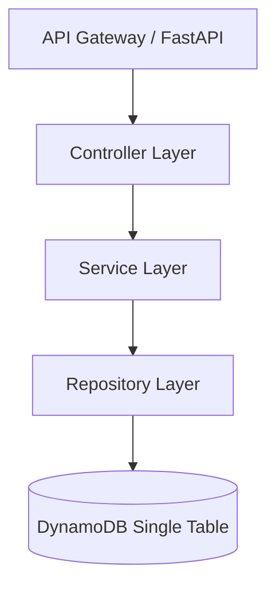

# Amazon LifeGraph Backend

## Project Overview
Amazon LifeGraph is a mission-centric commerce intelligence platform. The backend supports the Commerce Knowledge Graph and various engines (Outcome Verification, Decision Risk, Adaptive Decision, etc.). It uses a single-table DynamoDB design, adhering to Clean Architecture principles.

## Architecture Diagram


## Setup Instructions
1. Clone the repository: `git clone https://github.com/YESH-ctrl/LifeGraph.git`
2. Set up a virtual environment: `python -m venv venv`
3. Activate the environment:
   - Windows: `venv\Scripts\activate`
   - Unix: `source venv/bin/activate`
4. Install dependencies: `pip install -r src/requirements.txt`

## Local Development Instructions
We use FastAPI to provide a local verification environment without needing to deploy AWS SAM. 

Run the local server:
```bash
python -m uvicorn src.local_app:app --reload
```

## Swagger Usage
Once the local server is running, navigate to:
**http://127.0.0.1:8000/docs**

Here you can interactively test the Users, Products, and Carts APIs, verifying request payloads, response envelopes, and database interactions.

## Branching Strategy
We follow a structured branching strategy to enable concurrent team collaboration.

- **main**: Production-ready code. No direct commits allowed.
- **develop**: Integration branch.
- **feature/*** : Developer branches (e.g., `feature/graph-engine`, `feature/verification-risk`).

### Pull Request Workflow
1. Create a feature branch from `develop`.
2. Commit your changes locally.
3. Open a Pull Request targeting `develop`.
4. Code review and integration testing.
5. Merge into `develop`.
6. Once `develop` is stable, it will be merged into `main`.
